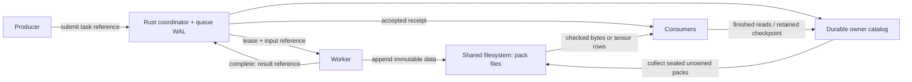

# Why straw?

[中文版](DESIGN_zh.md)

AI pipelines move more than text. A single sample may contain token IDs,
per-token scores, expert-routing decisions, embeddings, images and intermediate
state. Many small publications and several readers can make scheduler memory,
network copies and filesystem metadata more expensive than the payload itself.

straw separates three questions:

1. **Where are the bytes?** Immutable records in append-only pack files.
2. **Which work was accepted?** A queue journal with leases and stable receipts.
3. **Who still needs the bytes?** Durable owners in a shared storage catalog.

The coordinator handles metadata, not tensor payloads. Workers write directly
to the mounted filesystem. A completion has a durable receipt; retrying its
identity after a lost reply returns the original acceptance. Execution itself
may repeat, so application side effects need their own idempotency policy.

## Why immutable packs?

Immutability allows a producer, another queue and several consumers to share
one tensor. A reference identifies an extent by path, offset and length, so
later appends cannot change it. Manifests are records inside the same packs,
rather than extra files per logical object. Chunk checksums allow tensor row
reads without hashing an entire large tensor on every slice.

Copy-on-write means publishing a new version of the changed tensor. Unchanged
tensors can keep their references. This preserves previous versions, but a
changed tensor is currently copied in full. There is no memory-page COW,
live-record relocation or pack compaction.

## Why a Rust core with Python APIs?

Rust owns framing, validation, checksums, fsync, WAL replay, lease transitions
and storage ownership. Python exposes typed references and NumPy/PyTorch
conversion, and can host the coordinator in an existing application process.
The native calls release the GIL during core work. Input buffers are currently
copied into Rust-owned memory; the API does not promise zero-copy writes.

| Layer | Responsibility |
|---|---|
| Rust | File/path checks, framing, checksums, publication limits, durable writes, WAL, queue state machine and ownership/GC |
| Python bindings | Dataclass/JSON/buffer conversion, deployment declarations and native error mapping |
| Python tensor helpers | NumPy/PyTorch conversion, tensor descriptors and calls to checked native reads |
| Python tools and verification | Transport, benchmark orchestration, offline inspection, independent protocol model and failure injection |

The Python journal and coordinator classes call the Rust implementation; they
do not implement a second WAL or queue state machine. Verification deliberately
keeps an independent model and wire-format oracle so tests can expose mistakes
in the implementation, rather than reproduce the same code path.

Language choice alone does not establish throughput. Small durable transactions
can be limited by filesystem sync latency. Batch publications, writer reuse,
read fanout and realistic payload sizes matter; [measure your workload](BENCHMARKS.md).

## What straw deliberately leaves to its caller

- Worker placement, RPC transport, model execution and task meaning.
- One real, externally enforced coordinator owner per queue. A string naming
  an owner is a declaration, not fencing or consensus.
- Proof that a reader finished or its process stopped before releasing its
  roots. A lease timeout only revokes permission to commit.
- Durable application checkpoint finalization. A queue receipt cannot prove
  that a model optimizer update or an external side effect survived.
- Filesystem provisioning, quotas, access controls and durability qualification.

straw is currently suited to bounded jobs and explicit retention policies.
Full WAL/task history is replayed and retained in memory. Online GC reclaims
dead sealed packs, but does not bound journal growth or remove abandoned writer
ownership heuristically. Those are explicit limits, not automatic failover or
long-running database guarantees.
