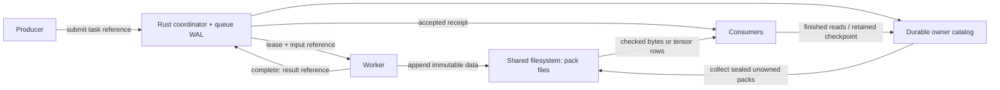

# 为什么需要 straw？

[English](DESIGN.md)

AI 流水线传递的不只是文本。一条 sample 可能包含 token ID、逐 token 分数、专家路由、embedding、图片和中间状态。大量小发布与多个 reader 会让调度器内存、网络复制和文件系统元数据的成本超过载荷本身。

straw 分别处理三个问题：

1. **字节存在哪里？** 追加式 pack 文件中的不可变记录。
2. **哪些任务结果已被接收？** 带 lease 和稳定 receipt 的队列日志。
3. **谁还需要这些字节？** 共享存储 catalog 中的持久化 owner。

协调器处理元数据，worker 直接向已挂载的文件系统写入张量载荷。任务完成会产生持久化 receipt；响应丢失后，以同一身份重试会返回原来的接收结果。计算本身可能重复执行，因此应用的外部副作用需要自己的幂等策略。

## 为什么使用不可变 pack？

不可变数据允许生产者、其他队列和多个消费者共享同一个张量。引用用路径、偏移和长度定位一个 extent，后续追加不会改变它。Manifest 也是 pack 内的记录，不为每个逻辑对象创建额外文件。分块校验允许按行读取张量，避免每次切片都重新计算整个大张量的哈希。

写时复制是指发布被修改张量的新版本，未变化的张量保留原引用。旧版本保持不变，但目前每次修改会复制整个张量；尚无内存页级 COW、存活记录搬迁或 pack 整理。

## 为什么用 Rust 核心与 Python API？

Rust 负责二进制帧、校验、checksum、fsync、WAL 重放、lease 状态转换和存储所有权。Python 提供类型化引用及 NumPy/PyTorch 转换，也可以在应用已有进程内承载协调器。Native 调用在核心操作期间释放 GIL。目前输入缓冲区会复制到 Rust 所有的内存，API 不承诺零复制写入。

| 层次 | 职责 |
|---|---|
| Rust | 文件/路径校验、framing、checksum、发布限制、持久化写入、WAL、队列状态机、所有权/GC |
| Python 绑定 | Dataclass/JSON/buffer 转换、部署声明与 native 错误映射 |
| Python 张量辅助接口 | NumPy/PyTorch 转换、张量描述符以及调用带校验的 native 读取 |
| Python 工具与验证 | 传输、benchmark 编排、离线检查、独立协议模型和故障注入 |

Python 的 journal/coordinator 类调用 Rust 实现，不再实现另一套 WAL 或队列状态机。验证有意保留独立模型和二进制格式参照，避免测试与实现走同一份逻辑、共享同一个错误。

语言选择本身不能证明吞吐量。小型持久化事务可能受文件系统同步延迟限制；批量发布、writer 复用、读 fanout 和真实载荷大小都会影响性能。请[测量自己的负载](BENCHMARKS_zh.md)。

## 调用方负责什么？

- Worker 部署、RPC 传输、模型执行和任务语义。
- 每个队列一个由外部机制真正保证的协调器所有者。描述 owner 的字符串是声明，不是 fencing 或共识机制。
- 释放数据根之前，证明 reader 已读完或其进程已停止。Lease 超时只撤销提交权限。
- 持久化应用 checkpoint 的最终提交。队列 receipt 无法证明模型优化器更新或外部副作用已经持久化。
- 文件系统部署、配额、访问控制及持久性认证。

straw 目前适用于有边界的任务和显式保留策略。完整 WAL/任务历史会重放并保留在内存中。在线 GC 回收已经无引用的封存 pack，但不会限制日志增长，也不会根据猜测清理遗留 writer 的所有权。这些是当前明确的限制，尚不具备自动故障切换或长期运行数据库的保证。
